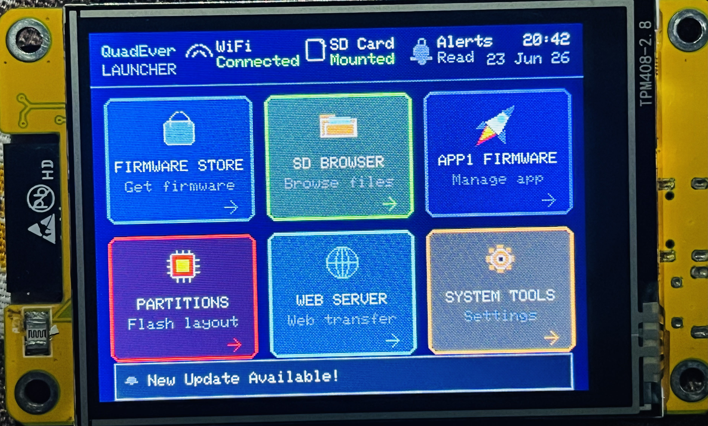
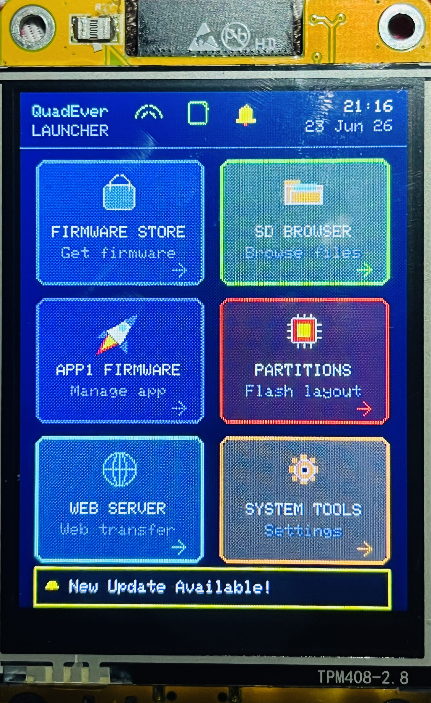
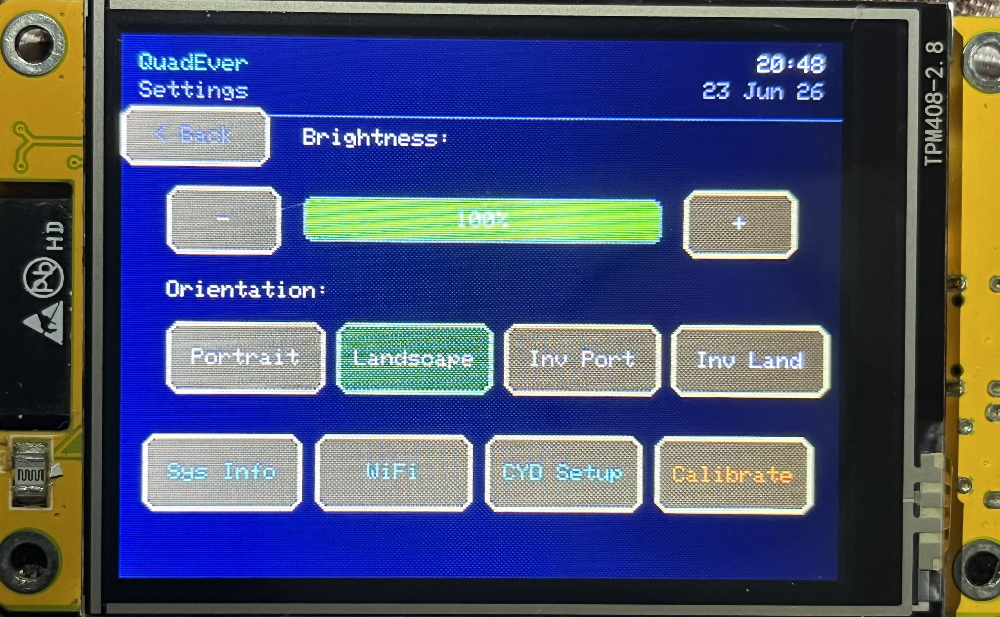
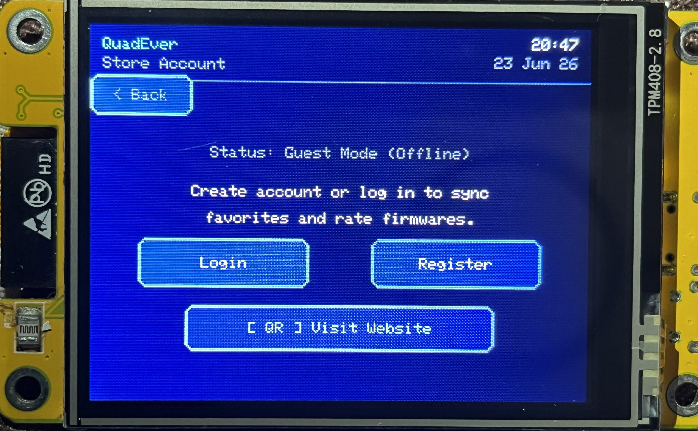
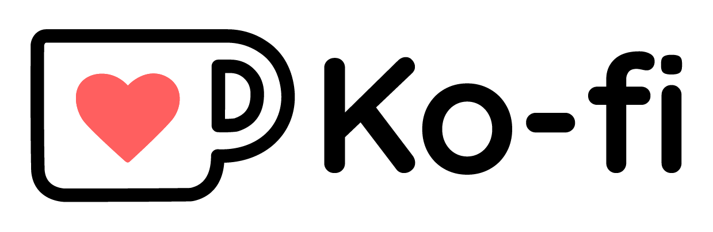

# 🚀 QuadEver Launcher

### *A Premium OTA Bootloader & App Manager for ESP32 Cheap Yellow Display (CYD-2432S028R)*

**QuadEver Launcher** is a highly optimized, feature-rich resident firmware launcher and app manager designed for the Cheap Yellow Display (CYD) ESP32-2432S028R development board. It allows users to store, browse, flash, and boot multiple application binaries (`.bin` files) from an SD card or wirelessly via a Web User Interface, transforming your CYD display into a versatile multi-tool.

  
📸 <b>Click to View Device Screenshot Gallery</b> (Scroll/Swipe horizontally to see all 15 screens! ↔️)

   
  <table align="center">
    <tr>
      <td></td>
      <td></td>
      <td></td>
      <td></td>
      <td></td>
      <td></td>
      <td></td>
      <td></td>
      <td></td>
      <td></td>
      <td></td>
      <td></td>
      <td></td>
      <td></td>
      <td></td>
    </tr>
    <tr>
      <td align="center"><b>Home Screen (L)</b></td>
      <td align="center"><b>Home Screen (P)</b></td>
      <td align="center"><b>Firmware Store (L)</b></td>
      <td align="center"><b>Firmware Store (P)</b></td>
      <td align="center"><b>SD Card Browser</b></td>
      <td align="center"><b>App Run Screen</b></td>
      <td align="center"><b>App Details & Ratings</b></td>
      <td align="center"><b>Firmware OTA Info</b></td>
      <td align="center"><b>System Settings</b></td>
      <td align="center"><b>Developer Portal Account</b></td>
      <td align="center"><b>Partition Setup Screen</b></td>
      <td align="center"><b>Partition Table Mapping</b></td>
      <td align="center"><b>Direct Flash & Erase</b></td>
      <td align="center"><b>Bootloader Setup</b></td>
      <td align="center"><b>System Info Screen</b></td>
    </tr>
  </table>

---

## ⚡ Quick Start: 1-Click Web Installer
No compile tools, command lines, or IDEs required. Flash directly from your web browser:

*Supported browsers: Google Chrome, Microsoft Edge, Opera (any WebSerial-compatible browser).*

---

## 📦 Dual-Firmware Configurations

To support the entire CYD developer community, QuadEver Launcher is distributed in two distinct builds:

### 1. ⚙️ Stock 4MB Version
* **Target Hardware:** Unmodified stock CYD boards (4MB Flash, No PSRAM).
* **Optimization:** Highly optimized RAM and flash footprint to fit standard partition limits.
* **Features:** Includes the full user interface, SD file browser, WiFi portal, NVS manager, on-screen keyboard, security lock, and WebUI server.

### 2. 🔥 Upgraded 16MB Version
* **Target Hardware:** Modded/Upgraded CYD boards (16MB Flash upgrade chip + PSRAM enabled).
* **Partition Size:** Expanded 6MB partition slot for Launcher and 6MB slot for User Applications
* **Performance:** Leverages external PSRAM for faster store catalog caching, smoother screen rendering, and loading large firmware binaries (like custom CYD games, Bruce, or Marauder).

---

## 🌟 Key Launcher Features

### 📁 SD Card Browser & Flash Manager
* **Browse & Select:** Navigate FAT32-formatted SD cards directly from the 2.8" LCD screen.
* **Smart Filtering:** Auto-detects and displays `.bin` firmware files along with file size.
* **Firmware Installer:** Flashes a selected `.bin` binary with a dynamic graphic progress bar. It automatically erases the previous binary before writing.

### 🏪 On-Device Firmware Store (WiFi)
* **Direct OTA Installation:** Connect your CYD to WiFi to browse, download, and install popular open-source firmware binaries (such as Bruce, Marauder, and other utility apps) directly over the air OTA
* **Smart Search & Orbiting Loader:** Search catalog apps using the on-screen keyboard, and enjoy a smooth orbiting circular loading animation during downloads.
* **Developer Self-Publishing Portal:** If you are a developer, you can register and log in to your developer profile directly. This allows you to publish, edit, and update your own custom firmware apps in the launcher database, making them instantly available to all CYD users globally.
* **Full App Details & Ratings:** View comprehensive information for each app (description, version, developer signature, download statistics, ratings) and rate applications on a scale from 1 to 5 directly from the display interface.

### 🎨 Premium UI & Responsive Design
* **Universal Rotation:** Fully responsive layout that dynamically adjusts buttons, borders, titles, and text alignments between **Landscape (320x240)** and **Portrait (240x320)** orientations.
* **Fat-Finger Friendly:** Standardized large touch boundaries (`65x30` in Portrait, `65x26` in Landscape for back buttons; enlarged listing rows) to guarantee accurate navigation without stylus pens.
* **Aesthetic Custom Themes:** Toggle between 5 custom visual styling presets (QuadEver Cyber, Green Matrix, Cyberpunk Red, Retro Amber, and Dracula Violet) directly from the security panel.
* **On-Screen Keyboard:** Virtual keyboard featuring shift states (UP), numeric/symbols (SYM), alphabetical (ABC), text cursor (black caret), and text-scrolling input box.

### 🌐 Wireless WebUI & Server
* **Wireless Operations:** Start a local web server directly on the CYD board.
* **Web File Manager:** Upload new firmware binaries, download logs, browse directory files, and delete items from your phone or PC browser.
* **NVS Inspector:** Read, write, or delete parameters from the ESP32 Non-Volatile Storage (NVS) over the web.

### 🔒 Device Security Locks
* **Protection:** Keep your settings or launcher safe by configuring a **4-digit numerical PIN** or a **Pattern Lock** screen.

---

## 🌐 Web Store & Flasher Features

The companion website provides an all-in-one desktop/mobile dashboard for your CYD board:

* **Browser-Based Flasher:** Connect your CYD via a micro-USB/USB-C cable, choose a firmware, click install, and flash the launcher directly via WebSerial.
* **Dedicated App Catalog:** Browse popular pre-compiled CYD applications uploaded by the community (Bruce, Marauder, custom setups).
* **Developer Portal:** Register as a developer (ends in `.dev`), upload compiled `.bin` packages, specify versioning/category, upload screenshot URLs, and manage download endpoints.
* **Ratings & Reviews:** Submit star ratings (1 to 5) and write reviews for catalog applications directly from the web or synced devices.

---

## 🔌 Hardware Pin Reference

| Component | Function | CYD GPIO Pin |
| :--- | :--- | :--- |
| **TFT Display** | MOSI / MISO / SCLK | 13 / 12 / 14 (HSPI Bus) |
| | CS / DC / RST / BL | 15 / 2 / -1 / 21 |
| **SD Card** | MOSI / MISO / SCLK / CS | 23 / 19 / 18 / 5 (VSPI Bus) |
| **Touch (XPT2046)**| MOSI / MISO / SCLK / CS / IRQ | 32 / 39 / 25 / 33 / 36 (Remapped VSPI) |
| **RGB LED** | Red / Green / Blue | 4 / 16 / 17 (Disabled by default for PSRAM compatibility) |

---
## ☕ Support ME

I built this firmware only for the CYD 2.8-inch LCD because I only own this development board. I cant build it for other boards like M5Stack, LilyGO, etc. Becouse i have not this boards Due to YOU KNOW!!! But guys, you can support me by buying me a Ko-fi! I will do my best, and your support will help me keep all services running. THANK YOU!

## 📄 License
This project is proprietary and closed-source. All rights reserved. Binary compilation and flashing are permitted for personal, non-commercial use on Cheap Yellow Display (CYD) hardware.
